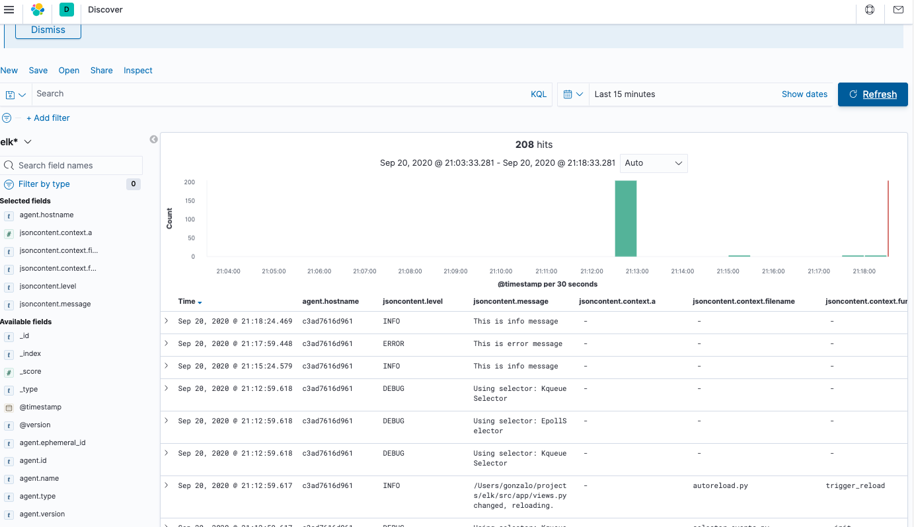

## Django logs to ELK using filebeat

I've written a post about how to send Django logs to ELK stack. You can read it [here](https://gonzalo123.com/2020/08/10/monitoring-django-applications-with-grafana-and-kibana-using-prometheus-and-elasticsearch/). In that post I've used logstash client with a sidecar docker container. Logstash client works but it needs too much resources. Nowadays it's better to use Filebeat as data data shipper instead of Logstash client. Filebeat it's also a part of ELK stack. It's a go binary much lightweight than logstash client.

The idea is almost the same than the other post. Here we'll also build a sidecar container with our django application logs mounted.

```yaml
version: '3'
services:
  # Application
  api:
    image: elk:latest
    command: /bin/bash ./docker-entrypoint-wsgi.sh
    build:
      context: .
      dockerfile: Dockerfile
    environment:
      DEBUG: 'True'
    volumes:
      - logs_volume:/src/logs
      - static_volume:/src/staticfiles
  nginx:
    image: elk-nginx:latest
    build:
      context: .docker/nginx
      dockerfile: Dockerfile
    volumes:
      - static_volume:/src/staticfiles
    ports:
      - 8000:8000
    depends_on:
      - api
  filebeat:
    image: filebeat:latest
    build:
      context: .docker/filebeat
      dockerfile: Dockerfile
    volumes:
      - logs_volume:/app/logs
    command: filebeat -c /etc/filebeat/filebeat.yml -e -d "*" -strict.perms=false
    depends_on:
      - api

  ...
```

With filebeat we can perform actions to prepare our logs to be ready to be stored within elasticsearch. But, at least here, it's much more easy to prepare the logs in the django application:

```
class CustomisedJSONFormatter(json_log_formatter.JSONFormatter):
    def json_record(self, message: str, extra: dict, record: logging.LogRecord):
        context = extra
        django = {
            'app': settings.APP_ID,
            'name': record.name,
            'filename': record.filename,
            'funcName': record.funcName,
            'msecs': record.msecs,
        }
        if record.exc_info:
            django['exc_info'] = self.formatException(record.exc_info)

        return {
            'message': message,
            'timestamp': now(),
            'level': record.levelname,
            'context': context,
            'django': django
        }
```

And in settings.py we use our CustomisedJSONFormatter

```
LOGGING = {
    'version': 1,
    'disable_existing_loggers': False,
    'formatters': {
        'simple': {
            'format': '[%(asctime)s] %(levelname)s|%(name)s|%(message)s',
            'datefmt': '%Y-%m-%d %H:%M:%S',
        },
        "json": {
            '()': CustomisedJSONFormatter,
        },
    },
    'handlers': {
        'applogfile': {
            'level': 'DEBUG',
            'class': 'logging.handlers.RotatingFileHandler',
            'filename': Path(BASE_DIR).resolve().joinpath('logs', 'app.log'),
            'maxBytes': 1024 * 1024 * 15,  # 15MB
            'backupCount': 10,
            'formatter': 'json',
        },
        'console': {
            'level': 'DEBUG',
            'class': 'logging.StreamHandler',
            'formatter': 'simple'
        }
    },
    'root': {
        'handlers': ['applogfile', 'console'],
        'level': 'DEBUG',
    }
}
```

Finally we need to configure the logstash pipeline to consume the filebeat logs:

```yaml
input {
  beats {
    port => 5044
    ssl => false
  }
}

filter{
  json {
    source => "message"
    target => "jsoncontent"
  }
}

output {
  elasticsearch {
    hosts => "elasticsearch:9200"
    manage_template => false
    index => "elk-%{+YYYY.MM.dd}"
    #keystore => /path/to/keystore.jks
    #keystore_password => realpassword
    #truststore =>  /path/to/truststore.jks
    #truststore_password =>  realpassword
  }
}
```

And that's all. Our Application logs centralized in ELK and ready to consume with Kibana


